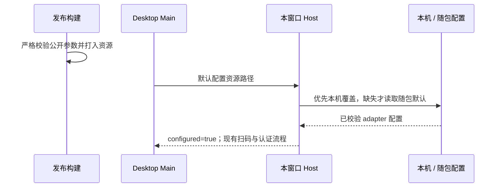
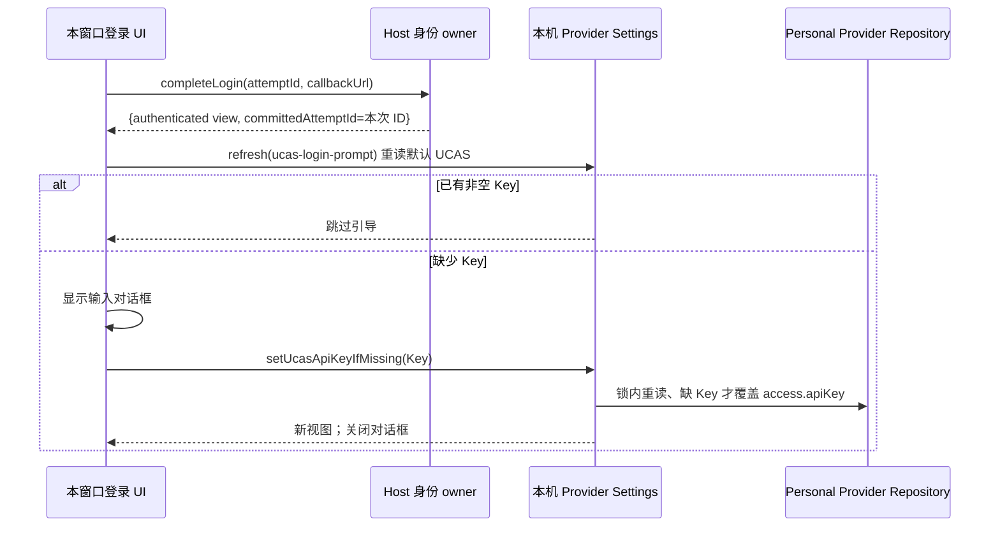
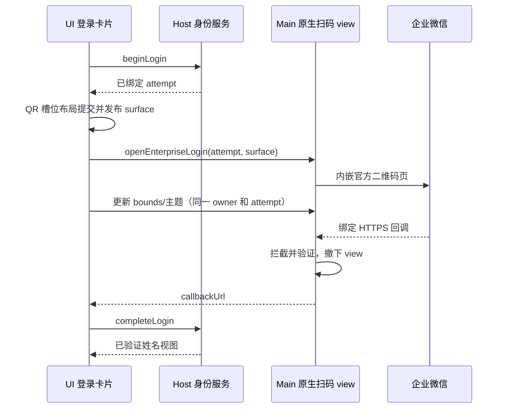
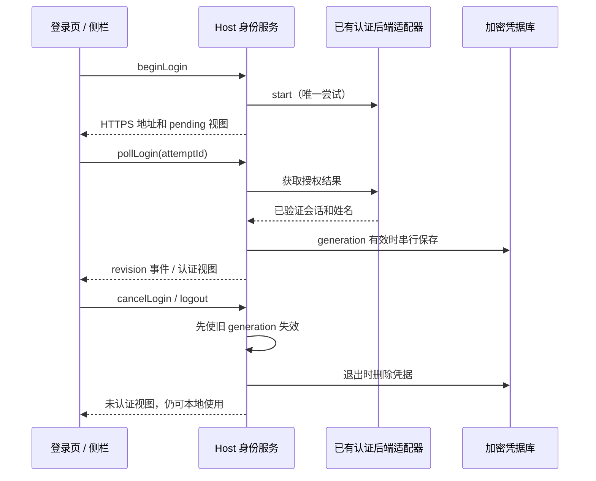
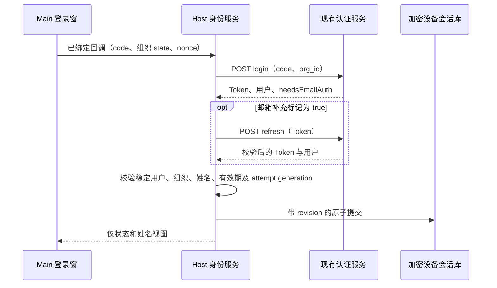
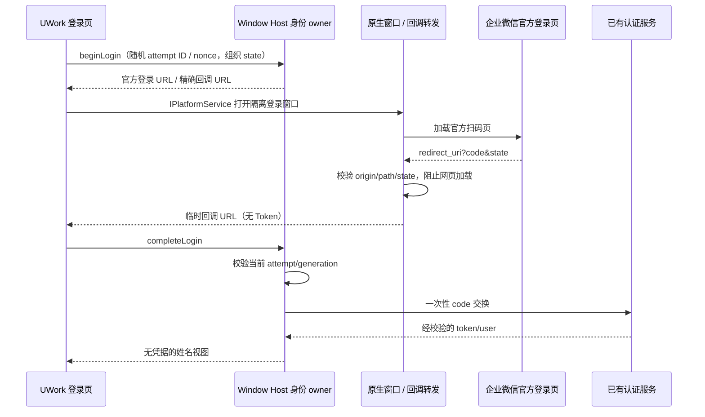

# UWork 可选企业身份登录

## 安装即可扫码的发布配置（2026-09-30）

- 正式 GitHub 安装包在 Windows、macOS、Linux 均携带经过严格 schema 校验的默认企业微信公开配置。仅包含 CorpID、AgentID、orgId、HTTPS 认证服务地址和同源回调；Secret、Token、UCAS Key 与用户会话不能进入配置或安装包。
- 默认配置从受信发布构建的 `UWORK_ENTERPRISE_IDENTITY_CONFIG` 加密配置注入，暂存于 Git 忽略的构建目录，再复制到 `resources/config/enterprise-identity.json`。源码不记录真实企业参数。缺少或无效构建配置必须阻断正式构建；每个平台打包后重新校验资源内容与注入配置一致。
- Main 是安装布局路径的唯一所有者，向 window-scoped Local Host 注入默认配置路径。Host 先读取本机 `.zcode/v2/enterprise-identity.json`；本机文件不存在时才读取随包默认文件。显式本机配置无效时不悄悄回退；两者均不存在的开发环境仍可跳过登录。本机覆盖不被安装升级修改。
- 配置源只决定 adapter 接入，不改变 IdentitySessionStore、attempt generation、owner/lease、跨窗口同步或 desktop-continuous/web-remote-replayable 边界。新安装无本机配置即可启用扫码；有默认 UCAS Key 时不重复引导，没有时沿用下述登录后输入对话框。

验收：缺少本机文件时加载随包配置并可开始扫码；本机覆盖优先；损坏覆盖、损坏默认和多余凭据字段被拒绝；各平台资源校验通过，隔离新数据目录的桌面登录按钮启用并可打开扫码槽位。真实扫码仍由用户在企业微信确认。

## 扫码成功后的 UCAS API Key 引导（2026-09-30）

- 本窗口的企业微信扫码回调经 Host `completeLogin` 验证并提交后，返回严格校验的 `{ view, committedAttemptId }`。只有 `view.status=authenticated` 且 `committedAttemptId` 等于本窗口本次 attempt ID，才调用本机 Provider Settings 的 `refresh("ucas-login-prompt")` 重读默认 UCAS（固定 ID `ucas`）；仅当刷新后的个人配置中没有非空 API Key 时弹出输入对话框。不能只读本窗口缓存，否则其它 Host 刚写入的 Key 在轮询同步前会被误判为空。迟到或失效的 callback 即使返回其它窗口已认证的 view，也没有本次提交标记，不能触发引导。会话自动恢复、其它窗口的身份广播、只读手机 attachment、扫码取消及认证失败均不触发。
- 对话框说明企业身份与 UCAS 密钥是两项独立配置，提供遮蔽的 API Key 输入、“保存”和“稍后设置”。空白输入不能提交；稍后设置不影响已完成的登录或本地工作区。刷新 Provider Settings 失败时不猜测密钥是否缺失，也不阻塞登录；用户仍可从模型设置配置 UCAS。
- 密钥只写入默认 UCAS 的现有 Personal Provider 配置，不写入身份会话、日志或模板。弹窗调用 `IProviderSettingsService.setUcasApiKeyIfMissing`；ProviderConfigService 在 Personal Repository 的文件锁事务中重读当前 UCAS 记录，若已有非空密钥则不替换，若缺少则仅覆盖 `access.apiKey`，保留当时最新的其它个人配置、模型关联与 headers。失败保留对话框与输入以供重试，且不撤销企业登录。登录退出不清除已保存密钥。
- 登录 UI 仅拥有本窗口对话框开关与未提交输入；IdentitySessionStore 继续唯一拥有认证事实，ProviderConfigService/Personal Provider Repository 继续唯一拥有 UCAS 配置。两者不互相复制状态或凭据。新的扫码尝试、退出或组件卸载使旧引导检查失效，迟到检查不能重新打开对话框。
- 扫码 surface 的取消控制器只在 Host 返回带 callbackUrl 的 native attempt 后创建；外部浏览器轮询路径不持有该控制器。轮询认证事件即使快于 `beginLogin` 调用的继续执行，也不能被误判为 surface 取消而撤销已完成的身份；继续执行前复核当前认证状态，已完成时不再打开过期授权 URL。

验收：真实扫码成功路径在无 Key 时显示对话框；保存后重新加载能从 UCAS 配置读取密钥，原有配置不丢失。已有 Key 不弹；稍后设置和保存失败不影响认证；恢复、跨窗口同步、取消、失败和只读 attachment 不弹。共享 UI 浏览器 E2E 用隔离 fixture 覆盖原生回调后的交互；实际扫码与已安装 Desktop 客户端另行验收。执行相关测试、`pnpm typecheck`、`pnpm lint` 和架构检查，区分 fixture 与真实扫码证据。

### 本次验证记录

- 2026-09-30：29 项定向服务及 surface 测试通过，覆盖本次 Host 提交回执、旧回调、跨窗口认证、UCAS 缺 Key 原子补录与其它 Host 的配置更新。隔离 browser-harness E2E 通过，覆盖无 Key 弹窗、保存/重载、稍后设置、已有 Key、刷新看到其它窗口新 Key、提交时并发写入、失败重试、窄屏布局和取消。
- `pnpm typecheck`、架构检查及改动文件格式检查通过；`pnpm lint` 为 0 错误、57 条既有警告。当前 shell 是 Node 25.9.0，仓库 `mise.toml` 指定 24.14.0，本机未找到 `mise`。本轮未运行实际企业微信扫码或已安装 Desktop 客户端验证。

## 主窗口内嵌扫码改版

### 新版独立授权页布局修复（2026-09-29）

- 真实新版授权页使用 `wwLogin_standalone/wwLogin_frame/wwLogin_panel/wwLogin_qrcode`，可能直接在顶层绘制二维码。不能仅以旧版 `loginPanel/impowerBox` 或存在扫码 iframe 为布局依据。
- Main 的固定展示样式负责将新版 120px 顶部留白和 480px 固定面板改为槽位内自适应布局；隐藏扫码页的装饰性标题、重复品牌头和页脚，保留授权操作、扫码描述、失败/过期提示及刷新二维码操作。二维码连同白色安全留白完整显示并水平居中；不能通过改授权 URL 或降低整个网页缩放来掩盖裁切。
- UI 继续唯一拥有扫码槽位与主题，Main 按原 sender、attempt 和文档 generation 应用展示样式；Host 的登录尝试、回调校验、取消和共享身份版本规则保持现有契约。
- 验收同时覆盖直接绘制的新版 `wwLogin_*` 顶层页面与旧版扫码子 frame。隔离 Electron 场景在窄槽位、浅/深色及 1/1.25 倍缩放下检查二维码完整、居中和状态/刷新操作可见。安装后必须查看真实授权页，fixture 通过不能替代实际布局确认。

- 登录卡片删除 U 字母图形和 UWork wordmark，删除身份登录说明与本地功能说明；保留标题、登录操作、跳过操作和必要的未配置/失败/过期提示。
- 用户点击企业微信后，在同一登录卡片中显示二维码与授权状态。使用独立内存 partition 的 WebContentsView 挂在原 BrowserWindow 内，不创建第二个登录窗口，也不将远端登录页放入有应用权限的 Renderer。
- UI 是扫码区域几何、颜色和字体的唯一所有者，通过 IPlatformService 发布严格验证的 surface 快照。Main 只持有 native view、请求绑定和短期回调路由；Host 继续持有登录尝试和设备会话。布局必须实际挂载后才打开 native view，使用可取消的就绪握手，不能用延时猜测 DOM 是否已渲染。
- Main 内嵌已验证成功的新版 Web 登录 URL，完整保留其路径、编码、appid、agentid、org state 与带 nonce 的回调，不转换成旧版 qrConnect。用户实测旧版入口提示回调域不匹配，不能要求修改后台来迁就界面。远端装饰性标题、外卡片背景与字号由固定 CSS 适配；二维码保持白色安全边距，扫码/确认/失败等授权状态不隐藏。
- bounds 从 CSS viewport 换算到 Electron DIP，随窗口尺寸、缩放和 UI 主题更新；每条更新只作用于原 sender 和同一 attempt ID。颜色、字体等只接受有界样式值，不接受任意 CSS、脚本或 URL。
- 授权文档导航会使固定样式节点与 origin zoom 失效；Main 按文档 generation 清理样式缓存，在新文档完成后重新应用当前 UI 缩放和主题，旧异步样式任务不得覆盖新文档。
- 新版登录页包含独立的扫码 iframe。仅适配顶层文档会留下 iframe 的固定宽度、标题和白色外框并截断二维码。Main 必须把固定展示样式应用到同一 guest 内、官方白名单 origin 的每个授权 frame；不读取表单、二维码内容、Cookie 或网页资料。顶层仅将官方扫码 iframe 填满已测量槽位；子 frame 的 QR 和状态居中，保留安全留白与授权操作。每个 frame 加载/导航后按本次文档重新适配；不得更换授权地址或隐藏错误、确认等状态。
- 原有 HTTPS origin/端口/path、组织 state、每次唯一 nonce、唯一 code 校验保持。跳过、关闭窗口、Renderer 重载、失效尝试与完成都撤下 view、关闭 WebContents 并清理独立会话；网络/认证失败仍可跳过。

验收：没有品牌块与两段冗余说明；点击后不增加 BrowserWindow，二维码在卡片内且浅/深色和字体一致；缩放、resize、窄屏不覆盖跳过按钮；跳过/取消/重载不遗留 view，迟到回调不能登录；真实扫码回调仍由原 Host 完成校验。Web/只读 attachment 不获取 native 登录权限。

改版验证：42 项相关 Node 测试通过；共享 UI E2E 覆盖文案删除、取消/失败恢复、窄屏 surface 更新和跳过，均通过。隔离 Electron fixture 确认只存在原 BrowserWindow，view 随取消撤下、回调页未先消费 code、允许域导航后 CSS 与 1.25 倍缩放重新应用。根项目 typecheck、架构检查通过，lint 为 0 错误和 57 项既有警告。额外 Main tsc 仍有 149 行既有诊断，新增扫码文件无诊断。内嵌 SDK 路由的真实扫码与视觉确认仍待测试窗口中的用户验证，不能用 fixture 登录代替。

## 产品规则

- 桌面打开时，未认证用户看到登录页，首期只展示企业微信，始终可以“跳过登录，继续使用”。跳过只关闭当前窗口的登录页，重启后仍可选择登录。
- 启动时的身份配置和恢复结果为未知状态，不能在首帧显示“未配置”。等待期间允许跳过；跳过仅取消本 Renderer 已取得 ID 的登录尝试，不能中断 Host 的设备会话恢复。若跳过发生在 beginLogin 返回前，取得 ID 后再按该 ID 取消。
- 侧栏 UWork 字标下：未登录显示可点击的登录入口；认证后显示姓名，点击查看来源并退出。右侧保留助理/开发切换。
- 有效会话自动恢复；过期、断网或恢复失败均允许跳过。缓存姓名不能冒充验证成功。
- 本轮身份只是本地应用的可选身份标签，不引入账号隔离、云数据或权限控制；现有工作区、会话、API Key、引导记录继续属于本地设备。登录/退出不认领、迁移或删除这些数据。
- 旧智谱/Z.ai OAuth 与套餐 RPC 继续退役。企业身份拥有独立类型、服务、事件与凭据命名空间。
- 用户已有认证服务，Desktop 使用随包默认公开配置或本机覆盖接入标准自建应用扫码。开发环境两种配置均缺少时明确显示“企业微信登录暂未配置”，不制造登录结果、不另建认证后端。

## 所有者和边界

- 设备共享的 IdentitySessionStore 经 CredentialService 的加密存储唯一拥有会话和全局 revision；Window-scoped Local Host 的 EnterpriseIdentityService 拥有本窗口尝试及已验证视图。Renderer 的 Zustand 只保存投影，登录页开关是 UI 状态。
- 应用层身份 Provider 固定使用 base services，远端工作区不能替换该身份。Main 通过 IPlatformService 管理隔离授权窗口及临时回调路由，不保存身份或 Token。
- Node 适配器支持 start/complete/restore；poll 和远端 revoke 为可选能力。Token 不进入 Renderer，Secret 不打包进 App。
- 通用 Credential RPC 隔离 enterprise-identity 命名空间的读、写和删除；身份服务在 Host 内持有原始凭据库。不能通过旧凭据接口伪造登录资料。
- RPC：getView、restoreSession、beginLogin、pollLogin、cancelLogin(attemptId)、logout、onDidChange。取消命令必须携带当前 attempt ID，缺失或不匹配时无副作用。视图含单调 revision、configured、status、profile、pending，不含 Token。用户信息必须含稳定 ID、企业 ID、provider 和姓名。
- 开始/取消/退出使旧 generation 失效并中止请求；凭据写入串行化，发布事件在持久化完成后。迟到响应不能复活取消的登录或覆盖新会话。
- 断网保留加密凭据供重试；恢复时即使本地 expiresAt 已过，也先向 issuer 发起 refresh 验证。issuer 明确拒绝或返回无效会话才清理；未配置适配器不恢复历史凭据。
- 同一设备共享一个企业账号，登录和退出跨窗口同步；广播只触发从私有会话库读取并重新验证，不接受 UI 提供的姓名或 Token。
- 普通 Web 可使用同一入口；手机 attachment 只投影桌面 Host 的身份，不显示启动登录页，不另起身份服务。任务流、owner/lease、workspaceIdentity、desktop-continuous/web-remote-replayable 语义不变。

## 验收

1. 未配置服务：启动页有企业微信、未配置提示和跳过；跳过进入工作区，再次登录入口有效。
2. 注入测试适配器：成功后姓名显示在 Logo 下；持久化和恢复成功；退出保留本地功能。
3. 重复 start/poll 合并；取消/退出/恢复后的迟到结果无效，过期清理；事件无 Token。
4. 非 HTTPS 地址、无稳定用户/企业 ID、无姓名、无效有效期被拒绝；失败始终可跳过。
5. Electron E2E 验证跳过、重新打开、未配置提示、姓名投影和退出；成功路径只用隔离测试适配器，不声明真实企业微信登录通过。
6. 执行相关 Node 测试、pnpm typecheck、pnpm lint、pnpm architecture:check --changed；Web 与 attachment 边界分别记录证据。真实扫码等待已有服务接口和测试环境。

## 当前对接与验证记录

## 标准扫码接入增量（2026-09-29）

- 用户已提供 CorpID、AgentID；应用使用官方新版 Web 登录链接（login_type=CorpApp），不把微信内 snsapi_base 网页授权当成扫码登录。
- Desktop 通过 IPlatformService 打开独立 sandbox 登录窗口。Main 只管理该窗口、导航白名单、回调路由与关闭，不保存身份、Token 或登录业务结果。登录页面不启用 Node、不提供 preload，使用临时 session partition。
- Host 生成每次唯一的随机 attempt ID 和 5 分钟有效期；当前标准企微请求使用已绑定的 orgId 作为 state，并在 redirect_uri 放入随机 attempt ID 作为 uwork_nonce。回调必须精确匹配配置的 HTTPS origin/path、组织 state、nonce 和唯一 code。旧适配器仍可使用随机 state。截获回调后停止网页加载，避免网页和 Host 重复消费一次性 code。
- Host 使用已有 POST /api/auth/login（code、org_id）换取 token/user，user.id、user.org_id、user.name 与 JWT exp 必须通过校验，返回组织必须与配置一致。JWT 仅在受信 HTTPS 服务响应中用于读取有效期；恢复必须经 POST /api/auth/refresh 验证，不能以本地解码代替认证。
- 2026-09-29 实测服务返回 needsEmailAuth=true。现有网页先保存 Token/姓名，再尝试一次邮箱授权；后续即使该标记仍为 true 也可结束登录。因此该标记不能单独解释为身份认证拒绝。本期 UWork 仅展示姓名，不采集邮箱；收到该标记时，Host 必须先用返回 Token 请求已有 refresh 接口，只有服务确认会话有效、稳定用户/组织一致且姓名有效后才提交设备会话。refresh 拒绝、身份变化、缺失姓名或网络失败均不能登录；不修改服务、不伪造邮箱授权。

- HTTPS 网络通过已有 HostApiNetworkTransport，禁止重定向泄露 Bearer Token；不自动重试 code 交换。CorpID、AgentID、认证服务地址与回调通过受信发布配置进入默认资源，本机文件可覆盖；不在源码提交中记录真实企业标识或内部地址，不保存企业微信 Secret。
- 企业服务公开前端只有本地退出语义，未确认远端吊销接口；App 退出只清理本地会话，不声称已吊销服务器 Token。
- 身份 RPC 新增 completeLogin(attemptId, callbackUrl)；原 poll 模式保持兼容，native callback 模式不轮询虚构接口。跳过、关闭登录窗口或退出使旧回调失效；原外部浏览器登录适配器仍按自身 poll 语义工作。
- 用户确认同一设备共享一个企业账号，登录和退出同步到所有窗口。加密 IdentitySessionStore 是设备会话唯一持久化事实源；窗口 Host 只拥有当前尝试和视图投影。跨 Host 文件锁覆盖版本比较、写入和取消回滚。
- 登录与退出递增全局 revision。beginLogin 记录起始 revision，complete 仅在该版本仍有效时写入；跨窗口退出后旧扫码不能复活身份。续期在相同账号与 revision 下以 Token 条件写入，不触发登录广播回环。
- 广播只携带 revision，不携带姓名或 Token；其它 Host 读取受保护的会话并通过后端续期验证后更新视图。过时广播忽略；不能信任 Renderer 发送的认证资料。手机 attachment 继续只读既有 Host 的身份。

增量验收：错误 state、重复参数、跨 origin/端口/path、非 HTTPS、任意导航和新窗口被阻止；重复/迟到 callback 不重放 code 交换；取消关闭原生窗口；真实扫码需要用户在企业微信确认，登录与续期响应仍需真实验证。

## 组织绑定修复

公开 OAuthCallback 前端将回调 state 传为 login(code, org_id)，服务的 authorize(org_id) 也将 state 设置为该组织 ID。CorpID 与服务的 org_id 是不同标识，不能省略组织绑定或将随机 UUID 当作 org_id。标准扫码适配器必须配置明确的 orgId，并在 code 交换时发送该值；缺失配置应在发起扫码之前拒绝。组织只在与已指定 CorpID 唯一匹配时自动绑定，不根据列表排序选择。

此前原生回调仍使用独立随机 state；没有收到该绑定回调或没有服务端认证成功时，不把企微内网页的登录状态视为 UWork 登录。后续回调方式须保留随机请求绑定和跨窗口 stale 防护，不能为了兼容组织路由而去掉防伪验证。

用户明确服务侧不能修改，并批准兼容方式：标准请求的 state 使用已绑定的 orgId；每次 attempt.id 仍由 Host 随机生成，在 redirect_uri 中以单个 uwork_nonce 参数传递。Main 和 Host 同时检查精确 origin/端口/path、唯一 nonce=attempt.id、唯一 state=orgId、唯一 code，拒绝多余参数。旧的随机 state 适配器仍按原验证路径处理。

仅在 UWork 控制的登录窗中可拦截回调（含 iframe）；独立的企微客户端或系统浏览器中的网页可能自行消费授权码，不声明能够控制它们。真实验证必须确认 UWork 确实收到自己的绑定回调并由后端交换成功。

## 认证失败诊断边界

真实扫码已进入 code 交换但失败时，必须区分 HTTP 拒绝、响应字段不匹配、额外验证、Token 格式/有效期和网络中断。Node 日志只输出固定 reason、HTTP status、已知错误分类或 schema 字段路径；禁止输出响应原文、授权码、Token、姓名、企业标识或内部地址。UI 继续使用简短失败提示，不以测试进程退出码或扫码确认冒充认证成功。

## 前一增量验证

2026-09-29：已有网站公开前端确认 authorize、login(code/org_id)、refresh，当前授权 URL 是微信内网页授权。未取得桌面扫码结果回传契约；生产适配器仍未配置。详见 [对接说明](../docs/enterprise-identity-integration.md)。

- 相关 Node 测试 17 项通过，覆盖私有凭据边界、身份生命周期、过期、重复请求和迟到写入回滚。
- 共享 UI 浏览器 E2E 通过：跳过、再次打开、Esc、草稿保留、姓名位置、退出、320–1440px 布局、英文/深色/长姓名与 attachment 只读边界。成功身份来自隔离 fixture。
- pnpm typecheck 和 pnpm architecture:check --changed 通过；pnpm lint 为 0 错误、57 项既有警告。
- main/host/preload 与 renderer 生产构建曾通过。隔离 Electron 实例在数据库准备阶段发生 transport_closed，未进入 Root，桌面 E2E 未通过，未替换已安装应用。
- 真实企业微信扫码、服务端续期/吊销、跨窗口认证和远程 attachment 真实传输尚未验证。

> 状态更新（2026-10-09）：真实扫码登录已在 3.16.0 的生产环境跑通（三家域名各自的 `appid` 与回调，桌面端 handoff 登记 201、认领回传）。登录流程中的后置 refresh 校验随真实登录执行；**服务端仍不提供 Token 吊销端点**，退出只清设备会话，不宣称远端已吊销。

## 当前增量验证（2026-09-29）

- 真实扫码测试先定位到 needsEmailAuth 标记导致客户端拒绝；兼容实现随后完成 login 交换、refresh 校验、姓名校验和设备加密会话提交，测试进程输出 VERIFIED 并以 0 退出。
- 新测试进程读取已保存的同一设备会话，经真实 refresh 再次验证成功，无需重新扫码。真实姓名和 Token 未写入测试输出。
- 当前 41 项相关 Node 测试通过，包含邮箱标记的服务端再验证、拒绝续期、用户/组织变化以及脱敏诊断。typecheck、架构检查通过，lint 为 0 错误、57 项既有警告；当前 main/host/preload 和 renderer 生产构建通过。
- 后续完整启动确认问题来自已删除的 recent 项目与缺失的 conversation 备用 cwd；Host 改为准备前统一创建 app-managed 目录，保留历史业务路径。真实 Coordinator 覆盖已删除 recent、显式打开、全新 Host 和 mkdir 失败四个场景，均通过；44 项相关 Node 测试通过。
- 最终正式 app 本体通过依赖闭包、arm64 平台和严格本机签名验证，隔离安装包启动及跳过登录 E2E 通过。按用户授权替换 /Applications/UWork.app 后，真实设备会话自动恢复，主界面确认姓名存在且位于 UWork Logo 下，登录页自动关闭。真实多窗口退出同步仍未验证；既有同步 fixture 测试不能代替该验证。
- 没有修改已有认证服务。已有服务未提供吊销端点，退出只清除设备会话，不宣称远端 Token 被吊销。

## 多组织（多子公司）支持（2026-10-08）

**背景**：ucas-proxy 一个控制面已托管三家子公司（生产实测：北京 `beijing` / 南京 `nanjing` / 厦门 `xiamen`，另有 `admin` 组织；各自的企微自建应用与 `custom_domain` 不同）。此前客户端内置配置只有一组 `{corpId, agentId, orgId}`，南京/厦门员工用当前客户端**没有登录入口**。

**产品规则**

- 一份客户端支持多个组织：配置给出组织清单（`orgId` + `corpId` + `agentId` + 可选 `label`）与可选 `defaultOrgId`；登录卡片在清单长度 > 1 时展示公司选择，长度为 1 时不展示（行为与今天一致）。
- 选择**只决定用哪家企微应用扫码**，不是授权依据：请求 `org_id`、回包 `org_id`、续期 `tenantId` 三处仍按选中的组织校验，不匹配即拒绝（沿用既有边界，不放宽）。
- 选择被本机记住（`{appConfigDir}/enterprise-identity-organization.json`），下次直接出该公司的码；值为空或不在清单内时回落 `defaultOrgId` → 清单第一项。**分发可裁剪**：给某家公司的安装包只写自己那条，员工端看不到选择器。
- 单组织旧配置（`{corpId, agentId, orgId}`）继续被接受并在解析时归一化成清单形式，已发布包与本机覆盖无需改造。
- 登录后展示当前公司：身份菜单标题与登录卡片用服务端回包 `org_id` 对应清单里的 `label`（缺失时用 `orgId`），不用本地选择值冒充身份。
- 扫码形态不变：仍是每家自己的企微自建应用（`login_type=CorpApp`）。"一个通用码、扫完自动识别公司"需要企微服务商（第三方应用/代开发）形态，属单独立项，不在本增量。

**信任边界**

| 事实         | 所有者                                                                    | 说明                                                   |
| ------------ | ------------------------------------------------------------------------- | ------------------------------------------------------ |
| 可选组织清单 | 内置 / 本机覆盖配置（`wecomIdentityConfigSchema`）                        | 白名单；未列出的 `orgId` 一律拒绝，不接受 URL/env 注入 |
| 本次登录组织 | `IEnterpriseIdentityService` 选择状态 + 适配器 attempt（`expectedState`） | `state` / 请求 `org_id` / 回包校验三处一致             |
| 记忆的偏好   | `identityOrganizationStore`                                               | 仅设备偏好，不参与任何授权判断                         |
| 身份与资源   | ucas-proxy（org 行 + `userId` 维度）                                      | 客户端不做跨组织资源访问                               |

**服务端前置（另一仓库 ucas-proxy）**：① `organizations.wecom_corp_id`/`custom_domain` 加唯一约束；② 空/缺失 Host 直接 404；③ `/api/review` 补齐组织校验。**2026-10-09 全部完成并上线**：唯一约束用部分索引（`WHERE <> ''`，放过未配置的组织）并在路由层映射成 409；`/api/review` 的 records/export 按目标用户所属组织校验，content 按 `audit_meta.key_hash` 归属判定、查不到归属即拒绝；随后又补了 handoff 登记的组织校验与 `/api/review/models` 的按组织收敛。生产 192.168.100.143 已部署并实测，明细见文末「状态回填」。

**验收**

- 单组织旧配置、三组织新配置都能解析；重复 `orgId`、`defaultOrgId` 不在清单、非 HTTPS、跨 origin 回调被拒。
- 选南京后授权 URL 的 `appid`/`agentid`/`state` 全部来自南京那条；回包 `org_id` 不是南京时登录失败且会话不落盘。
- 选择在重启后保持；选择值不在清单内时回落默认组织。
- 清单长度 1 时无选择器，行为与既有版本一致。

**本次验证记录（2026-10-08，隔离实例 `UWORK_DATA_BASE_DIR=/tmp/uwork-org-check/home`）**

- 登录卡片按配置清单渲染三家公司（北京默认选中、南京、厦门），按钮文案为「用北京企业微信登录」。
- 选择南京后：按钮变为「用南京企业微信登录」，偏好文件 `{appConfigDir}/enterprise-identity-organization.json` 写入南京 `orgId`。
- 点登录后桌面打开的企微授权页实测参数：`appid=ww1ef227672ebe1618`（南京）、`agentid=1000027`、`state=c1715513-9ff7-4d4f-a129-226bc1cf65f0`（南京）—— 选择只驱动「扫哪家码」，与设计一致。
- 单组织旧配置（已发布包/本机覆盖）解析后归一化成一条清单，行为与既有版本一致（既有 41+ 项身份测试未改动仍全绿）。
- 门禁：typecheck、lint（0 error / 56 既有警告）、fmt:check、architecture:check --changed（0 违规）通过；CI 定向测试清单 17 个文件 **103 项全通过**（含新增的多组织解析、按组织授权、回包组织不匹配拒绝、选择记忆三组）。

**回调域名必须逐组织核对（2026-10-08 生产实测）**：企微在授权页按「该企业应用后台配置的授权回调域名」校验 `redirect_uri`，**端口参与匹配**。生产 openresty 为三家公司各起一个 server 块（`/www/sites/pivot{,-nj,.ansilic}*`）：`pivot.ucas.com.cn:23090`、`pivot-nj.ucas.com.cn:23091`、`pivot.ansilic.com:23092`（都反代 `127.0.0.1:23080` 的同一份 SPA）。用企微授权页做「3 个应用 × 候选域名」矩阵实测，**只有对角组合出二维码**，交叉组合（含"正确域名 + 错误端口"如 `pivot-nj.ucas.com.cn:23090`）全部报「redirect_uri 与配置的授权完成回调域名不一致」。所以 `callbackUrl` 必须逐组织取、且与企微后台逐字一致（含端口）；不要按"同域名不同端口"或 443 默认端口推断。

**二维码阶段的回头路**：多组织时等待扫码的卡片提供「重新选择公司」——取消当前尝试、保留登录入口并回到选择器（与「跳过登录」的区别是不关闭弹窗）。

## 审查修复契约（2026-10-09）

身份服务是组织选择和视图唯一 owner。组织偏好选择串行执行，持久化成功后提交内存选择和视图；写入失败保留旧选择，UI 显示失败并允许重试。并发选择的失败不得回滚后续成功值。

初始化由共享 Promise 持有，getView/restoreSession/beginLogin 均等待同一次 hydration；初始化发布视图须检查 generation/disposed，不覆盖较新的登录状态。

Renderer 发起 start → 用户返回 → 旧 start 返回/失败 → 仅取消旧 attempt → 新 start admission → 新公司二维码。返回时无 attempt ID 的启动由本窗口 pending Promise 持有；下一次登录等待旧启动结算及取消后才入 Host，不能复用旧 startTask。旧 handler 不打开原生窗口、不覆盖新视图、不取消新 attempt；连续返回/重试遵守同一屏障。该窗口取消不使用缺失 ID，保留设备恢复与其他窗口边界。

验收覆盖延迟启动、失败与过期、偏好写入失败/重试/连续选择、并发 hydration 及 dispose。真实扫码和服务端多租户生产前置独立验收。

组织选择与登录的 admission 顺序：已接收的连续选择全部完成持久化/失败结算后，beginLogin 才读取当前组织并启动。服务通过 selection 完成屏障等待完整队列，不只等待已经进入全局 writes 的第一笔写入；后续选择不得把已启动 attempt 的组织归属漂移。

## 状态回填（2026-10-09）

服务端多租户前置与随后的清扫已在 ucas-proxy 完成并部署到生产（192.168.100.143，只重建 control-plane）：

| 项 | 位置 | 线上实测（2026-10-09） |
| --- | --- | --- |
| 一家公司 = 一个企微应用 = 一个入口域名 | `organizations` 的 `wecom_corp_id`/`custom_domain` 部分唯一索引；`PUT /api/orgs/:id` 冲突返回 409 | 两个索引在真实 4 组织 / 252 用户上建成；重复配置返回 409 |
| 空/缺失 Host 不再回落 | `/api/auth/authorize` 无 Host 直接 404 | 裸请求 404；三家域名各自返回自己的 `appid`；陌生域名 404 |
| 审计读取按组织 | `/api/review` 的 records/export/content | 北京 org_admin 按南京用户的 wecom_userid / 内部 id / 姓名过滤全部 403，读南京 blob 403，本组织与 super_admin 正常 |
| handoff 登记的组织必须存在 | `POST /api/auth/handoff/start` | 不存在的组织 404 且不留登记行；真实组织与不传 `org_id` 均 201 |
| 模型下拉按组织收敛 | `GET /api/review/models`（含按组织的缓存键） | 三家分别 8/7/6 个模型，无缺失、无越界；仅北京用过的模型未泄漏；super_admin 见全库 14 个 |

**仍开放（不属于本增量验收，但要记得）**

- 服务端没有 Token 吊销端点：退出登录只清设备会话。
- MCP 的服务清单过滤只在 mcp-gateway 进程内，控制面 `/internal/mcp/servers` 返回全部启用项（含解密 env）。生产当前只有 1 个全局 server（`ucas-rag`），暂无实害；给某家公司配专属 server 前必须先修。
- AIHub 账号绑定 / 私有技能（见 `aihub-skill-source.md` 3.4）仍未做，前提是服务端先有 join（L2）。
- 组织级计费边界未落地：三家 `new_api_group` 同为 `beijing`、`channel_ids` 为空、`monthly_budget=0`，控制面算不出"每家花了多少"；南京/厦门也没有 `default_plan_id` 兜底（职位未匹配的新员工不会被自动订阅）。要不要按子公司核算由业务定。
- 小项：`desktop_login_handoffs` 只有 `expires_at` 索引、没有过期行清理（登记行会累积，无安全影响）。
